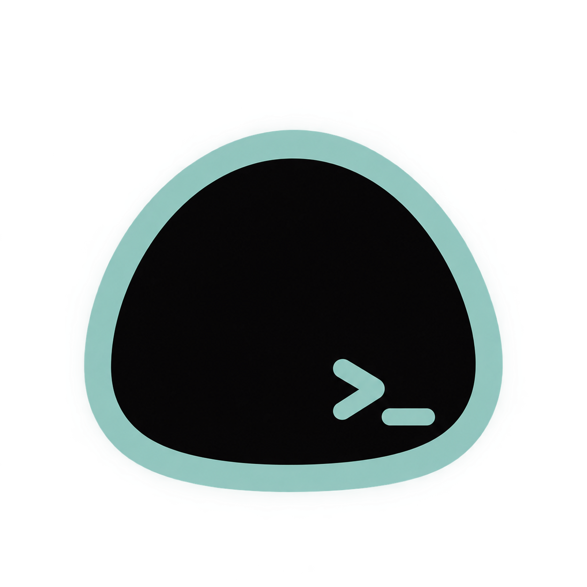

  

  # Mochi Agent

  **BYOK LLM client with multi-provider access, agentic workflows, and remote device control.**

  
  
  

Mochi Agent is an open-source Android client for using your own model accounts and endpoints. It stores conversations locally, sends model requests directly to the selected provider, supports non-linear message branches, and can extend agent runs with MCP, automation, search, memory, local models, and remote shell tools.

## Setup & Environment Variables

Untuk panduan lengkap pengesetan environment variables, JDK 17/21, Keystore signing, dan GitHub Actions CI/CD pada repository fork ini, silakan lihat [ENV_SETUP.md](ENV_SETUP.md).

